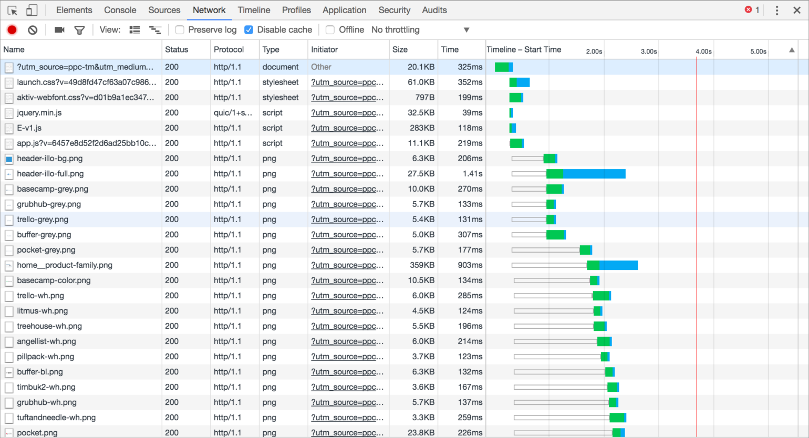
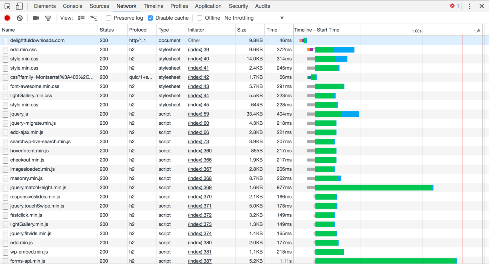

<!-- .slide: data-background="./images/hero_bg.jpg" -->
<h1 class="title dark-background"><span class="translucent">The Future of</span> Front-End Performance</h1>
<h2 class="subtitle">Sia Karamalegos</h2>

---

## hi, i'm sia


---

## Take out a piece of paper...


---

<!-- .slide: data-background="./images/elevator2.jpg" -->
<h1 class="dark-background">
  <span class="highlighter">Why do elevators have mirrors?</span>
</h1>

---

# Why Should I Care?

---

> Pinterest reduced load times by 40% and saw a 15% increase in sign ups.

<small>https://wpostats.com/</small>

---

> Starbucks implemented a 2x faster time to interactive resulting in a 65% increase in rewards registrations.

<small>[Chrome Dev Summit](https://www.youtube.com/watch?v=Xryhxi45Q5M&t=1113s&index=6&list=PLNYkxOF6rcIDjlCx1PcphPpmf43aKOAdF )</small>

---

> AliExpress reduced load by 36% and saw a 10.5% increase in orders.

<small>https://wpostats.com/</small>

---

> Speed is now used as a ranking factor for mobile searches.

<small>https://developers.google.com/web/updates/2018/07/search-ads-speed</small>

Note: In 2016, Doubleclick by Google released a report saying that 53% of mobile sites are abandoned if pages take longer than 3 seconds to load.

---

# Measurement and Analysis

Note: Does anyone know what the Pareto principle is?

---

## Pareto Principle

Roughly 80% of the effects come from 20% of the causes.

Note: So what does this mean?

---

## Be lazy. Only optimize the worst offenders.


---

# Which metrics matter?

---

## ~~Load time~~ Speed Index

Measures how quickly the page contents are visually populated

- Expressed in milliseconds
- Dependent on size of the view port
- Use [webpagetest.org](https://www.webpagetest.org/) to measure your pages

> Note: It is particularly useful for comparing experiences of pages against each other (before/after optimizing, my site vs competitor, etc) and should be used in combination with the other metrics (load time, start render, etc) to better understand a site's performance. Historically we have relied on milestone timings to determine how fast or slow web pages were.  The most common of these is the time until the browser reaches the load event for the main document (onload).  The load event is easy to measure both in a lab environment and in the real world.  Unfortunately, it isn't a very good indicator of the actual end-user experience.  As pages grow and load a lot of content that is not visible to the user or off the screen (below the fold) the time to reach the load event is extended even if the user-visible content has long-since rendered. Lighthouse may use a node module called Speedline for this.

<small>https://sites.google.com/a/webpagetest.org/docs/using-webpagetest/metrics/speed-index</small>

---

## Time to Interactive

<iframe width="560" height="315" src="https://www.youtube.com/embed/Lx1cYJAVnzA" frameborder="0" allow="autoplay; encrypted-media" allowfullscreen></iframe>

<small>End to End Apps with Polymer by Kevin Schaaf, Polymer Summit 2017</small>

Note: the point at which layout has stabilized, key webfonts are visible, and the main thread is available enough to handle user input.

---

## Jank or Responsiveness


Note: Frame rate or frames per second (fps), is one measure of responsiveness. Modern devices refresh their screens at a rate of 60 fps. Converting that to an individual frame, we theoretically have 16 ms to render. In actuality, the browser needs some of that time, so we should target 10ms per frame. Any more, and the human eye will be able to detect the jank or jitter.

---

# Measurement

---

## Synthetic Testing

Use WebPageTest and DevTools network tab to optimize load and speed index.

<video controls autoplay loop>
  <source src="./images/devtools_network.mp4" type="video/mp4">
  <p>Your browser doesn't support HTML5 video. Here is
     a <a href="https://i.gyazo.com/5164aab2cec42a31c6014a21c7b78f43.mp4">link to the video</a> instead.</p>
</video>

---

## Synthetic Testing

Use DevTools performance tab to optimize responsiveness.


Note: How does this image make you feel? Do you know what this comes from? How confident are you in your use of DevTools?

---

## Real User Monitoring (RUM)

- Navigation Timing API
- Resource Timing API
- User Timing API for custom timings

<small>
  https://developers.google.com/web/fundamentals/performance/navigation-and-resource-timing/
  <br />https://www.keycdn.com/blog/user-timing/
<small>

---

## Optimize for the device and network your users have

- 2-5x difference in fastest vs slowest phones
- 75% of worldwide mobile connections on 2G or 3G
- Not just developing countries but rural areas or spotty networks like conference wifi
- Use Google Analytics data to profile your users and configure [webpagetest.org](https://www.webpagetest.org/) to reflect them more closely
- Set performance budgets using webpack

<small>https://infrequently.org/2017/10/can-you-afford-it-real-world-web-performance-budgets/</small>

Note: Performance budgets at Google are $200 Android phone on a slow 3G network to target 5s initial load and 2s for subsequent. Converts to 130-170kb gzipped.

---

# Biggest Bytes

---

Images account for 39-43% of the bytes on average needed to load a webpage.

<small>[httparchive.org](https://httparchive.org), September 2018</small>

---

## Image Optimization Toolbox

- Use the right image type (`png` vs `jpg`, `gif` vs video).
- Use the right size and src sets, and webpack loaders to auto-build src sets.
- Compress images with a tool like ImageOptim, or use a webpack plugin to auto-optimize them for you.
- Use newer, improved formats like `webp`.

<small>
  https://www.udacity.com/course/responsive-images--ud882
  <br /> https://survivejs.com/webpack/loading/images/#optimizing-images
</small>

---

# Most Expensive Asset

Note: Are all assets created equally?

---

<iframe width="990.6990950226244" height="482" seamless frameborder="0" scrolling="no" src="https://docs.google.com/spreadsheets/d/e/2PACX-1vTlTFx0oq6iA73uPBd4X1kaF05-R82KHMMGF7wzgvPTvdgMsPyjKZk5fAPOmPhc33g_Zoul7EsB2Cg9/pubchart?oid=1765333686&amp;format=image"></iframe>

<small>Adapted from [The Cost of JavaScript](https://medium.com/dev-channel/the-cost-of-javascript-84009f51e99e) by Addy Osmani</small>

---

## TL;DR: Ship less code

- less code = less load + less parse/compile
- holy grail = prioritize only what's needed in view

---

## Client vs Server vs Progressive Rendering

<iframe width="749.4849246231156" height="463.3975" seamless frameborder="0" scrolling="no" src="https://docs.google.com/spreadsheets/d/e/2PACX-1vTlTFx0oq6iA73uPBd4X1kaF05-R82KHMMGF7wzgvPTvdgMsPyjKZk5fAPOmPhc33g_Zoul7EsB2Cg9/pubchart?oid=882710936&amp;format=interactive"></iframe>

<small>Inspired by https://twitter.com/aerotwist/status/729712502943174657</small>

---

## Client vs Server vs Progressive Rendering

<iframe width="749.4849246231156" height="463.3975" seamless frameborder="0" scrolling="no" src="https://docs.google.com/spreadsheets/d/e/2PACX-1vTlTFx0oq6iA73uPBd4X1kaF05-R82KHMMGF7wzgvPTvdgMsPyjKZk5fAPOmPhc33g_Zoul7EsB2Cg9/pubchart?oid=2121502741&amp;format=interactive"></iframe>

<small>Inspired by https://twitter.com/aerotwist/status/729712502943174657</small>

---

## Client vs Server vs Progressive Rendering

<iframe width="749.4849246231156" height="463.3975" seamless frameborder="0" scrolling="no" src="https://docs.google.com/spreadsheets/d/e/2PACX-1vTlTFx0oq6iA73uPBd4X1kaF05-R82KHMMGF7wzgvPTvdgMsPyjKZk5fAPOmPhc33g_Zoul7EsB2Cg9/pubchart?oid=1240736189&amp;format=interactive"></iframe>

<small>Inspired by https://twitter.com/aerotwist/status/729712502943174657</small>

---

## Client vs Server vs Progressive Rendering

<iframe width="749.4849246231156" height="463.3975" seamless frameborder="0" scrolling="no" src="https://docs.google.com/spreadsheets/d/e/2PACX-1vTlTFx0oq6iA73uPBd4X1kaF05-R82KHMMGF7wzgvPTvdgMsPyjKZk5fAPOmPhc33g_Zoul7EsB2Cg9/pubchart?oid=1546390226&amp;format=interactive"></iframe>

<small>Inspired by https://twitter.com/aerotwist/status/729712502943174657</small>

Note: Paul Lewis coined the term "uncanny valley". Optimizing for content visibility instead of time to interactivity can leave users more frustrated.

---

## Client vs Server vs Progressive Rendering

<iframe width="749.4849246231156" height="463.3975" seamless frameborder="0" scrolling="no" src="https://docs.google.com/spreadsheets/d/e/2PACX-1vTlTFx0oq6iA73uPBd4X1kaF05-R82KHMMGF7wzgvPTvdgMsPyjKZk5fAPOmPhc33g_Zoul7EsB2Cg9/pubchart?oid=1471728610&amp;format=interactive"></iframe>

<small>Inspired by https://twitter.com/aerotwist/status/729712502943174657</small>

Note: PRPL - push minimal code for initial route, render route and get interactive, pre-cache using service workers, and lazy-load async routes. Progressive bootstrapping - Send down a minimally functional page (composed of just the HTML/JS/CSS needed for the current route). As more resources arrive, the app can lazy-load and unlock more features.

---

## Optimizing Time to Interactive

- **Analyze your loads and bundles! Don't over-optimize!**
- **Only ship what's immediately needed** - use code splitting, pre-caching, and deferred or lazy loading.
- **Minify** to speed up both download and parse/compile.
- **Compress** with gzip or brotli.
- **Remove unused code** with tree shaking and using module imports effectively.

---

## Module Imports

```javascript
// Big
import _ from 'lodash';
_.isEmpty({});

// Big
import {isEmpty} from 'lodash';
isEmpty({});

// Little
import isEmpty from 'lodash/isEmpty';
isEmpty({})

// Big
import moment from 'moment';

// Little
import addMinutes from 'date-fns/addMinutes';
```

<small>Use Moment? Try [date-fns](https://date-fns.org/) instead.</small>

---

## The Cost of Unnecessary Transpiling

```html
<!-- Browsers with ES module support load this file. -->
<script type="module" src="main.mjs"></script>

<!-- Older browsers load this file (and module-supporting -->
<!-- browsers know *not* to load this file). -->
<script nomodule src="main.es5.js"></script>
```

---

## The Cost of Unnecessary Transpiling

<table>
  <thead>
    <tr>
      <th>Version</th>
      <th>Size <br />(minified)</th>
      <th>Size <br />(minified + gzipped)</th>
      <th>Parse/eval time (avg)</th>
    </tr>
  </thead>
  <tbody>
    <tr>
      <td>ES2015+</td>
      <td>80K</td>
      <td><strong>21K</strong></td>
      <td><strong>172ms</strong></td>
    </tr>
    <tr>
      <td>ES5</td>
      <td>175K</td>
      <td><strong>43K</strong></td>
      <td><strong>367ms</strong></td>
    </tr>
  </tbody>
</table>

<small>https://philipwalton.com/articles/deploying-es2015-code-in-production-today/</small>

Note: We transpile and polyfill most code, but most users are on modern browsers. So why are we shippping Unnecessary code? What's the impact?  Webpack can create 2 bundles for you - transpiled to ES5 and not-transpiled ES2015+. These are the results from a small blog app - remember since JS is most expensive asset this affects not just download but parse and compile time. <strong>Bigger apps mean bigger gains</strong>. No time to go through how, but this article goes through the steps. (test using script type=module, set up separate webpack config and need to include modules

---

> Most of your time is spent using the app, not waiting to load.

<small>Devin Villegas, Netflix senior dev ops engineer</small>

---

## Optimizing Responsiveness

- **Don't block the main thread!**
- Avoid memory leaks - garbage collection can pause execution
- Avoid long-running JS (>50ms) - chunk into smaller pieces, and/or use `requestAnimationFrame()` or `requestIdleCallback()` for scheduling
- Use up-to-date frameworks that prioritize user input (like React Fiber starting in React v16.0)

<small>
  https://medium.com/dev-channel/the-cost-of-javascript-84009f51e99e
  <br />
  https://philipwalton.com/articles/why-web-developers-need-to-care-about-interactivity/
</small>

Note: If script executes for more than 50ms, time-to-interactive is delayed by the entire amount of time it takes to download, compile, and execute the JS — Alex Russell. Note that 3rd party widgets and scripts can significantly impact responsiveness.

---

# Latency &amp; Caching

Note: Who is brave enough to admit they don't really know what that means?

---

<section>
  <h2>latency</h2>
  <p>/ˈlātənsē/</p>
  <ol>
	  <li class="fragment fade-in-then-semi-out">the state of existing but not yet being developed or manifest; concealment.
      <br /><small><em>"tension, and the latency of violence, make the greatest impressions"</em></small></li>
	  <li class="fragment fade-in-then-semi-out">the delay before a transfer of data begins following an instruction for its transfer.
      <br /><small><em>"poor performance due to network latency"</em></small></li>
  </ul>
</section>

---

## HTTP/1.1



<small>https://deliciousbrains.com/performance-best-practices-http2/</small>

Note: Starts downloading assets as TCP connections become available

---

## HTTP/2



<small>https://deliciousbrains.com/performance-best-practices-http2/</small>

Note: In addition, header compression. HTTP2 server push has not lived up to the promise, but it's still a new area. For the most part, need to use https.

---


<small>https://twitter.com/jaffathecake/status/1044121129848377344</small>

---


<small>https://twitter.com/addyosmani/status/743571393174872064?lang=en</small>

Note: pdf version of this is in the replies to this tweet

---

## Latency Case Study: Fonts

```css
@import url('https://fonts.googleapis.com/css?family=Open+Sans|Muli');

h1 {
  font-family: 'Open Sans', sans-serif;
}

p {
  font-family: 'Muli', sans-serif;
}
```

---

## Loading Google Fonts from CSS


---

## Loading Google Fonts from HTML

```html
<link href="https://fonts.googleapis.com/css?family=Muli:400"
      rel="stylesheet">
```


---

## Google Fonts with preconnect!

```html
<link rel="preconnect" href="https://fonts.gstatic.com/" crossorigin>
<link href="https://fonts.googleapis.com/css?family=Muli:400"
      rel="stylesheet">
```


---

## Webfonts

<ul class="plus-minus">
  <li class="plus">Hosted on fast and reliable CDNs</li>
  <li class="plus">Can provide optimized variants based on user's browser</li>
  <li class="plus">Opportunity for shared caching on popular fonts</li>
  <li class="minus">Minumum of 2 separate requests</li>
  <li class="minus">Can't use resource hints on the font file</li>
  <li class="minus">Doesn't take advantage of HTTP2 multiplexing</li>
  <li class="minus">No control over FOUT or FOIT</li>
</ul>

---

## Self-hosted fonts

```html
<link as="font" type="font/woff2"
  href="./fonts/muli-v12-latin-regular.woff2" crossorigin>

<link as="font" type="font/woff2"
  href="./fonts/muli-v12-latin-700.woff2" crossorigin>
```


Note: This alone does not fix perf problem.

---

## Preloading self-hosted fonts

```html
<link rel="preload" as="font" type="font/woff2"
  href="./fonts/muli-v12-latin-regular.woff2" crossorigin>

<link rel="preload" as="font" type="font/woff2"
  href="./fonts/muli-v12-latin-700.woff2" crossorigin>
```


<small>Note that `preload` loads a resource whether used or not. Only preload resources that are needed on a particular page. Don't self-host popular webfonts like Open Sans or Roboto (sabotages caching).</small>

Note: `rel="preload"` tells the browser to declaratively fetch the resource but not “execute” it (our CSS will queue usage). `as="font"` tells the browser what it will be downloading so that it can set an appropriate priority. Without it, the browser would set a default low priority. `type="font/woff2` tells the browser the file type so that it only downloads the resource if it supports that file type. `crossorigin` is required because fonts are fetched using anonymous mode CORS.

---

## More Latency and Caching Strategies

- Adjust network download priority with **priority hints**
- Use appropriate **caching headers**
- Use **service workers** for precaching and offline optimization - this is hard, try [Workbox](https://developers.google.com/web/tools/workbox/)!
- **Lazy-load** non-critical assets

<small>[Preload, Prefetch And Priorities in Chrome](https://medium.com/reloading/preload-prefetch-and-priorities-in-chrome-776165961bbf) by Addy Osmani<br>https://developers.google.com/web/tools/workbox/</small>

Note: PRPL pattern - push, render, pre-cache, lazy-load

---

<!-- .slide: data-background="./images/baggage_claim.jpg" -->
<h1 class="dark-background">
  <span class="highlighter">Houston's Baggage Claim Complaints</span>
</h1>

<small>http://www.nytimes.com/2012/08/19/opinion/sunday/why-waiting-in-line-is-torture.html</small>

Note: “Often the psychology of queuing is more important than the statistics of the wait itself,” notes the M.I.T. operations researcher Richard Larson. Occupied time (walking to baggage claim) feels shorter than unoccupied time (standing at the carousel).

---

> Are you better off making the site load faster or ensuring that users complete their tasks?

<small>Christine Perfetti, [The Truth About Download Time](https://articles.uie.com/download_time/) 2006</small>

---

<!-- .slide: data-background="./images/hero_bg.jpg" -->
<h1 class="title dark-background">Thanks!</h1>
Slides, resources, and more at <a href="https://bit.ly/siaspeaks" class="dark-background">bit.ly/siaspeaks</a>

